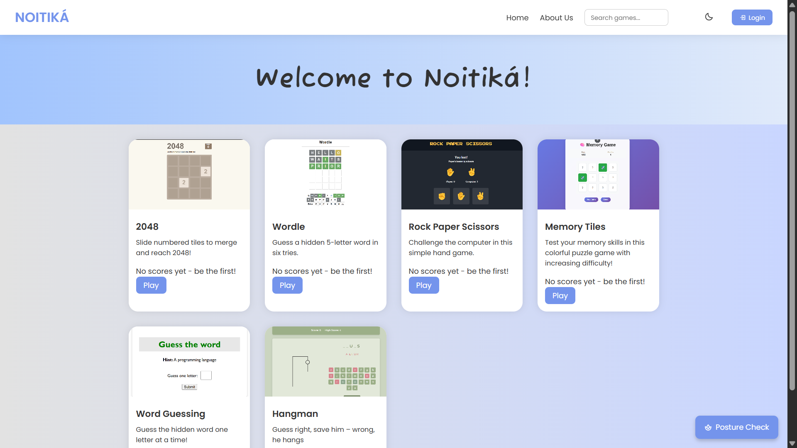
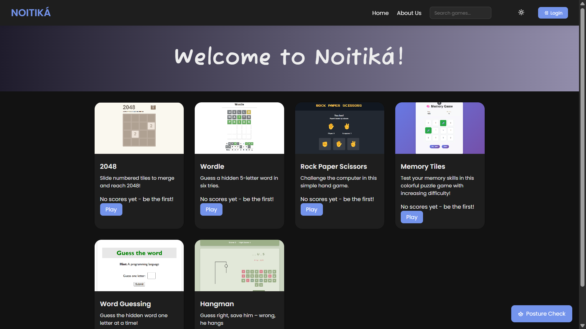
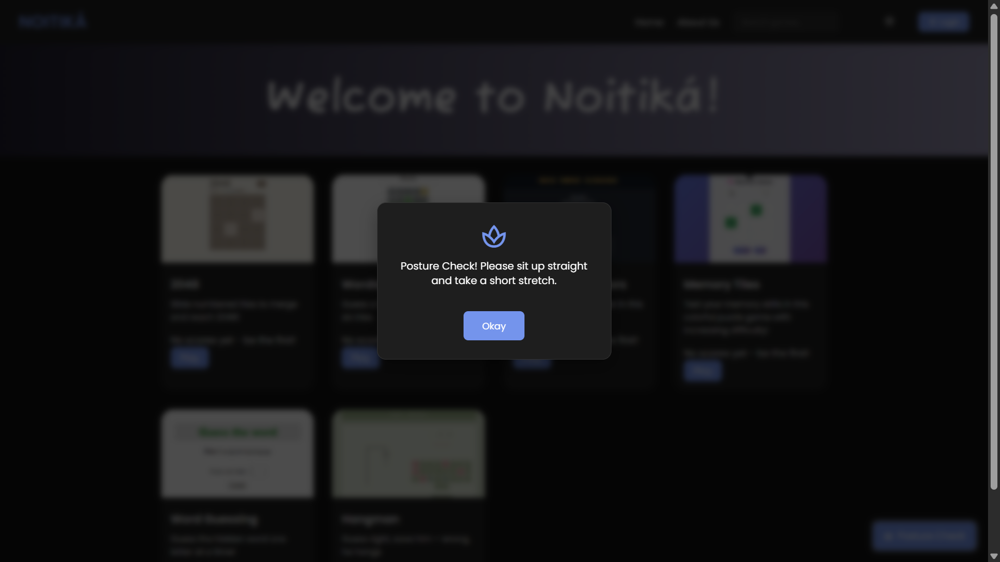
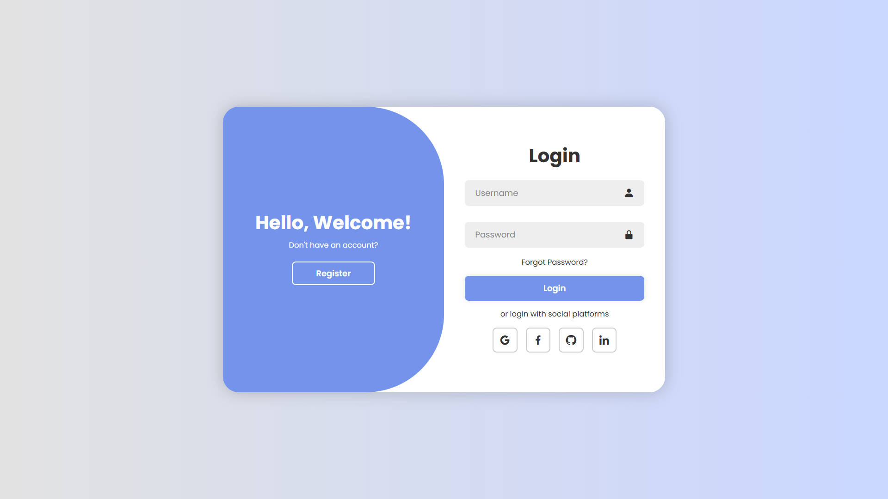

# 🎮 Noitiká – Simple Games, Smart Breaks

Noitiká is a responsive web-based gaming hub designed to provide quick, mindful breaks from overstimulation and doomscrolling. It offers a collection of simple, lightweight games like 2048, Wordle, Rock Paper Scissors, Memory Tiles, Word Guessing, and Hangman, along with wellness-focused features like a 15-minute posture reminder and dark mode support.

---

## ✨ Features

- 🎲 Casual Games – Fun, lightweight, and intentionally non-addictive.
- 🧘 Posture Reminder – Gentle alert every 15 minutes for mindful breaks.
- 🌙 Dark/Light Mode – Comfortable viewing anytime.
- 🔐 Authentication – Sign up/login with session management.
- 🏆 Score Tracking – Per-game scores for logged-in users (via Supabase).
- 📱 Responsive – Looks great on desktop and mobile.

---

## 🚀 Setup & Installation

### 1) Clone the repository
    git clone https://github.com/yourusername/noitika.git
    cd noitika

### 2) Supabase setup
- Create a free Supabase project.
- From the Supabase dashboard, copy your **Project URL** and **Anon Key**.
- In your codebase, replace the placeholders in `script.js` (top of file) where indicated by comments.
- Ensure database objects exist (use Supabase Table editor or SQL):
  - Tables: `game_scores`, `user_game_stats`
  - RPC/Function: `update_user_stats` (updates highest score, total plays, last played)
- Recommended: Enable Row Level Security (RLS) with policies that allow users to read global highs and read/write only their own rows.

### 3) Run locally
- Open `index.html` directly in your browser, **or**
- Use the VS Code “Live Server” extension for a better local dev experience.

---

## 📸 Screenshots

> Add images to a `screenshots/` folder and update paths below.

### Home Page (Light Mode)

### Home Page (Dark Mode)

### Posture Reminder

### Login Page

---

## 🔮 Future Enhancements

- More casual games across genres.
- Optional multiplayer and lightweight leaderboards.
- OAuth (Google/GitHub) for secure auth.
- Cross-device sync for scores and sessions.
- Lightweight mobile apps (Android/iOS).
- Enhanced wellness nudges (stretches, hydration).

---

## 👩‍💻 Author

 

  
---
